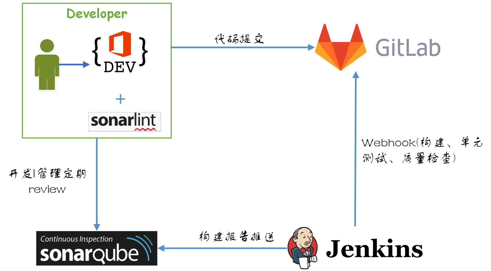

# 持续集成 - 前端代码质量管理  
  
## 代码质量的关注点  
软件产品质量主要有：功能性、可用性、稳定性、高效性、可维护性等等..  
代码质量是软件产品质量的一部分，主要的关注点有：    
* 可用性  
	- 正确运行  
	- 功能正常   
	- 满足需求
* 编程规范性 
	- 禁止可能产生错误的写法
	- 嵌套层次
	- 行数、行宽
	- 最佳实践
* 可读性
	- 文档
	- 注释
	- 缩进
	- 分块
* 可重用性  
	- 避免重复的代码
	- 提供公共组件和模块
* 可测试性  
	- 测试设计
	- 测试执行
* 可维护性  
	- 实现有层次
	- 注释和配置清晰
	- 可识别及定位问题
	- 修复或扩展时影响范围小
* 高效性  
	- 最小的资源消耗
	- 最短的计算时间
	- 合理遵循设计模式
	- 正确使用缓存
。。。
 
## 代码质量低下原因
没有代码规范，没有有效的质量管理手段，软件产出烂代码的可能性就会很高，主要体现在以下几个方面：  
* 技术经验不足  
技术更新很快，往往技术使用不成熟，无良好的编程习惯，编写的代码问题较多，质量无法保证。  
* 交付压力  
我现在很忙。交付期限快到了，等有时间我们会解决这个问题的。现在，我们需要把握重点，把这个问题先搁一搁。
* 人员变动  
对原有实现理解有偏差，原有的代码可读性不好，继续产生新的低质量代码。
* 破窗效应  
在看到低质量代码后，自己产生烂代码的心理负担要小。
* 传染性  
随时间推移，公司相似性项目也越多，新项目一般参照或照搬以前的工程修改。看到质量差的代码久而久之也会当做理所当然，导致更多烂代码出现。

## 质量改进方案  
1. 编码规范   
	- 风格规范
	- 可能产生bug的写法
	- 不建议的写法  
2. 单元测试  
	- 测试设计
	- 测试执行
3. 自动检测 
	- 代码规范
	- 重复代码
	- 单元测试覆盖率
	- 代码行数统计
4. 持续检测  
提供有效的持续构建方案，能在代码构建、提交等操作触发。
5. 质量管理   
	- 统一的规范管理
	- 可视化的审查结果
	- 代码Review  
6. 持续重构  
	- 阅读优秀源码
	- 多实践多重构

## 持续集成流程
  

## Sonarqube使用  
> Sonar是一个用于代码质量管理的开源平台，用于管理源代码的质量 通过插件形式，可以支持包括java,JavaScript,C#,C/C++,PL/SQL,Cobol,Groovy等等二十几种编程语言的代码质量管理与检测。  
* 持续检测    
SonarQube不仅能够显示应用程序的健康状况，还能突出显示新引入的问题。有了这个质量门，就可以修复漏洞，从而系统地提高代码质量。
* 检测棘手问题    
代码分析器装备了强大的路径敏感数据引擎，以检测诸如空指针、逻辑错误、资源泄漏等棘手的问题。
* 集中化的质量平台  
为开发人员、技术Leader和管理人员提供一个公共的代码质量管理平台，作为应用质量验证及发布的中心站。
* DevOps集成  
SonarQube集成了整个DevOps工具链，包括构建系统、CI引擎、升级管道……使用webhook和RestAPI。

### 代码规则配置  
### 质量阈
### 项目构建结果
### 问题处理  

##  其他 - git commit规范  
### 提交格式  
每次提交，Commit message 都包括三个部分：Header，Body 和 Footer。  
```  
<type>(<scope>): <subject>
// 空一行
<body>
// 空一行
<footer>  
```  
其中，Header 是必需的，Body 和 Footer 可以省略。
不管是哪一个部分，任何一行都不得超过72个字符（或100个字符）。这是为了避免自动换行影响美观。    
* feat：新功能（feature）
* fix：修补bug
* docs：文档（documentation）
* style： 格式（不影响代码运行的变动）
* refactor：重构（即不是新增功能，也不是修改bug的代码变动）
* test：增加测试
* chore：构建过程或辅助工具的变动  
* revert: 用于撤销以前的 commit  

### git hook  
commit-msg用来做提交message的规范检测。
